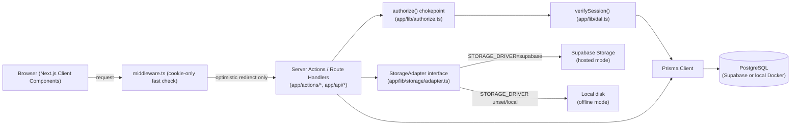
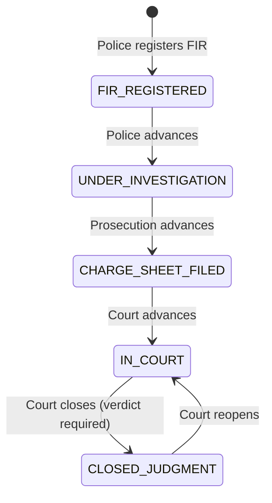
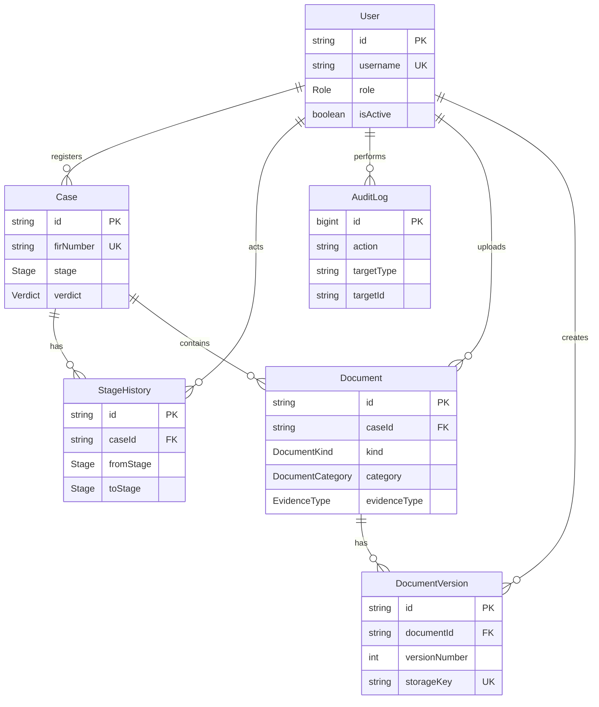
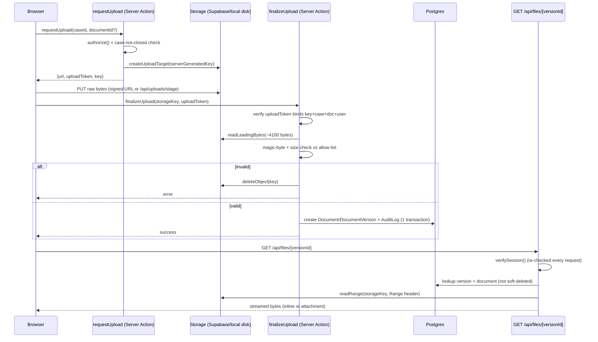

# CaseVault

CaseVault is a secure, centralized digital document management system for law
enforcement agencies, forensic labs, prosecution/legal departments, and
courts. Cases move through a defined lifecycle — FIR → Investigation → Charge
Sheet → Court → Judgment — and every case holds its documents (FIRs, witness
statements, charge sheets, court filings, forensic reports, judgments) and
digital evidence files, with every modification permanently recorded in a
write-once, append-only change log.

**Table of Contents**

[Quick Start](#quick-start)
[Feature Catalogue](#feature-catalogue)
[Problem-Statement Capability Map](#problem-statement-capability-map)
[Architecture](#architecture)
[Security Deep-Dive](#security-deep-dive)
[Local/Offline Setup & Seeding](#localoffline-setup--seeding)
[Tech-Stack Rationale](#tech-stack-rationale)
[Screenshots](#screenshots)

## Quick Start

**Live demo:** [https://casevault-henna.vercel.app/login](https://casevault-henna.vercel.app/login)

| Username | Role | Title | Department |
|----------|------|-------|------------|
| `ramesh.kulkarni` | Police | Inspector | Kotwali PS |
| `anjali.menon` | Forensics | Scientific Officer | Regional FSL |
| `priya.deshmukh` | Prosecution | Public Prosecutor | District Court Complex |
| `arvind.rao` | Court | Judge | Sessions Court |
| `suresh.iyer` | Admin | System Administrator | CaseVault HQ |

All 5 demo accounts share the password `CaseVault@123`.

## Feature Catalogue

### Authentication & Access Control

- Users log in and are assigned exactly one role: Police (IO/SHO), Forensics (FSL), Prosecution/Legal, Court (clerk/judge), or Admin
- Admin can create users and assign roles/departments
- Server-side enforcement is scoped to FIR registration (Police/Admin only), stage advance (owning department/Admin only, forward one step), reopen (Court/Admin only), and no edits to a closed case

### Case Lifecycle

- Police can register a case (FIR) with core case metadata
- Case moves through stages: FIR Registered → Under Investigation → Charge Sheet Filed → In Court → Closed/Judgment, with Closed/Judgment reachable only via a dedicated close action that requires a verdict
- Each stage is owned by a department for the purpose of moving it forward (Police: FIR + Investigation; Prosecution: Charge Sheet; Court: Trial + Judgment/reopen); every department can see and edit any open case regardless of stage — stages are progress indicators, not access gates
- Advancing a case stage moves it into the next department's dashboard queue; no department gains or loses access to the case
- Each role has a dashboard showing the cases currently in its department's stage ("At your stage" + "All other cases" sections)

### Documents & Evidence

- Authorized users can upload documents to a case, typed by category, with magic-byte and size checks enforced server-side
- Authorized users can upload digital evidence files (photos, video/CCTV, forensic data) linked to a case, via signed upload URLs in hosted mode
- Documents keep version history — a new version never overwrites older ones, and all remain viewable

### Search & Discovery

- Users can find cases by case/FIR number and title, and filter by stage and date range, from a dedicated search page and a header quick-search, with all parameters Zod-validated and the page guarded by server-side authorization

### Change Log & Audit

- Every modification (upload, new version, delete, metadata edit, stage change, role/user change) is written to an append-only change log no one can edit or delete
- Users can view the change log for a case/document (who, what, when)

### Loading & UX Feedback

- Every click/navigation gives visible loading feedback — a global nav-progress bar, shape-matched route skeletons, and pending labels/spinners on logout, search, filters, case tabs, and media previews — so the platform never looks hung

## Problem-Statement Capability Map

| Capability | Description |
|------------|-------------|
| Centralized storage | Every case's documents and evidence files live in one system, addressable by case, category, and version |
| Secure access/confidentiality | Custom session auth restricts the app to authenticated users; every write path checks role via a single server-side `authorize()` chokepoint |
| Prevention of unauthorized modification | Server-side role/action checks gate FIR registration, stage advance, reopen, and closed-case edits — never enforced only in the UI |
| Complete audit trail | Every modification is written to a database-enforced append-only change log (`REVOKE` + trigger reject `UPDATE`/`DELETE`, even for Admin) |
| Search/retrieval | Cases are searchable by case/FIR number, title, stage, and date range from a dedicated search page and header quick-search |
| Cross-department collaboration | Every department can see and act on any open case as it moves through its lifecycle, with stage-owning departments handling the forward moves |
| Compliance | Role-based access, an immutable audit trail, and version-preserved documents meet records-retention and evidentiary-integrity requirements |
| Cloud | Hosted deployment runs on Vercel + Supabase (Postgres + Storage); the identical codebase also runs fully offline via Docker Postgres + local disk, switched only by environment configuration |
| AI | OCR, auto-tagging, and natural-language search make documents and evidence faster to classify and find |
| Blockchain | Document and log records are anchored cryptographically, adding independent tamper evidence on top of the append-only change log |
| Digital signatures | Documents are digitally signed by the issuing officer, so authorship and integrity can be verified at every stage |
| Scalability | Postgres, object storage, and a stateless Next.js app scale horizontally as case and evidence volume grows |
| Asset lifecycle | Evidence and assets carry version history, chain of custody, and an audit trail across a case's entire lifecycle |

| Pain Point (SIH problem statement) | Addressed By |
|-------------------------------------|--------------|
| Hard-to-locate documents | Centralized storage; Search/retrieval |
| Unauthorized access | Secure access/confidentiality; Prevention of unauthorized modification |
| Tampering risk | Complete audit trail; Prevention of unauthorized modification |
| No version control | Centralized storage (document version history) |
| Poor inter-department collaboration | Cross-department collaboration |
| Weak auditability | Complete audit trail |

## Architecture

**Stack:** Next.js 16.3.5 (App Router) + React 19.3.0 + TypeScript 5.9.3 on PostgreSQL 16/17 via Prisma 6.19.3, styled with Tailwind 4.x, with custom session auth (`jose` + `bcryptjs`) — no Auth.js/NextAuth, no Supabase Auth.

**Project structure:**

```
app/
├── (auth)/login/          # Login page + Demo Accounts panel (DEMO_MODE gated)
├── (app)/                 # Authenticated route group
│   ├── dashboard/         # Role-scoped case queues
│   ├── cases/[id]/        # Case detail + Documents/Evidence/Change Log tabs
│   ├── cases/new/         # FIR registration (Police/Admin)
│   ├── search/            # Cross-case search
│   ├── admin/users/       # User management (Admin)
│   ├── admin/log/         # Audit log + tamper-test panel (Admin)
│   └── access-denied/     # Server-side authorize() redirect target
├── actions/               # Server Actions (cases, documents, users, audit, auth)
├── api/files/[versionId]/ # Sole authenticated file-read chokepoint
├── api/uploads/stage/     # Local-disk-mode upload PUT target
└── lib/
    ├── authorize.ts       # Single authorization chokepoint
    ├── session.ts         # jose-signed session JWT (8h sliding)
    ├── dal.ts             # verifySession() — DB re-check every call
    ├── case-guards.ts     # Stage-machine pure guard functions
    ├── document-guards.ts # Document-ownership/category guard functions
    ├── file-magic.ts      # Magic-byte allow-lists + detection
    └── storage/           # StorageAdapter interface + Supabase/local impls
prisma/
├── schema.prisma          # 6-model schema (User, Case, StageHistory, AuditLog, Document, DocumentVersion)
├── migrations/            # Includes hand-edited append-only trigger SQL
└── seed.ts                # Demo accounts + hero case + supporting cases
```

**Authorization is enforced by exactly one server-side chokepoint.** Every Server Action and Route Handler in this app calls `authorize()` (`app/lib/authorize.ts`), which always re-reads the caller's current role from the database via `verifySession()` before deciding — never from a cached or JWT-embedded value. `middleware.ts` is **UX-only**: it performs an optimistic cookie decode with no database call, purely to redirect an obviously-unauthenticated visitor before a page even starts rendering. It is never the authorization authority, and no route in this codebase treats it as one — the real gate is always `authorize()` on the server.

**File storage is switched by one environment variable, never by code branching.** The `StorageAdapter` interface (`app/lib/storage/adapter.ts`) is implemented by both `SupabaseStorageAdapter` and `LocalDiskStorageAdapter`; `getStorageAdapter()` picks between them purely based on `STORAGE_DRIVER` — `"supabase"` selects the hosted adapter, anything else (including unset) selects the local-disk adapter. Every caller — upload, finalize, read — goes through this same interface regardless of which adapter is active.

**Deployment** runs in two modes off the identical codebase: the primary demo is Vercel (app) + Supabase (Postgres + Storage), and the same code also runs fully offline on a single laptop via Docker Compose Postgres + local disk storage, as insurance against venue internet failure. Only environment configuration differs between the two.

### System Architecture



### Case Lifecycle State Machine

Forward-one-step only; `CLOSED_JUDGMENT` is reachable only via a dedicated close action requiring a verdict, never via a plain advance; only the owning department or Admin may advance a stage; Court or Admin may reopen a closed case.



### ER Data Model



### Upload + File-Serving Sequence



## Security Deep-Dive

### 1. Append-only audit log

Every modification is written to an `AuditLog` table that the database itself refuses to change. The initial migration revokes `UPDATE`/`DELETE`/`TRUNCATE` on `"AuditLog"` from the app's connecting role and installs a trigger that rejects any attempt outright:

```sql
REVOKE UPDATE, DELETE, TRUNCATE ON "AuditLog" FROM CURRENT_USER;
GRANT INSERT, SELECT ON "AuditLog" TO CURRENT_USER;

CREATE OR REPLACE FUNCTION audit_log_no_row_mutation()
RETURNS TRIGGER AS $$
BEGIN
  RAISE EXCEPTION 'audit_log is append-only: % is not permitted', TG_OP;
END;
$$ LANGUAGE plpgsql;

CREATE TRIGGER audit_log_block_update_delete
  BEFORE UPDATE OR DELETE ON "AuditLog"
  FOR EACH ROW EXECUTE FUNCTION audit_log_no_row_mutation();
```

A real hardening story sits behind this: the connecting `postgres` role turned out to be a member of Supabase's built-in `anon`, `authenticated`, and `service_role` roles via `INHERIT`, and Supabase's default-privileges setup auto-grants those three roles full DML (including `UPDATE`/`DELETE`/`TRUNCATE`) on every new table for its PostgREST auto-API. Because `postgres` inherited those grants, the original `REVOKE ... FROM CURRENT_USER` didn't actually block anything — it only removed the role's own direct grant while the inherited grant still applied. A follow-up migration closes the gap by revoking DML on `"AuditLog"` from `anon`, `authenticated`, and `service_role` individually (each guarded by an existence check, since those roles don't exist on local Docker Postgres), plus an unconditional `REVOKE ... FROM PUBLIC` as a backstop.

This is auth-gated access plus an append-only change log. Only authenticated users can reach the app at all, and every write path funnels through `authorize()`; the database guarantee is that once a row lands in the log, nothing — not even Admin, not even a direct database session using the app's own credentials — can edit or delete it.

### 2. Custom session auth

Sessions are signed JWTs (`jose`, HS256) stored in an httpOnly cookie, with passwords hashed via `bcryptjs` (pure JS, no native bindings). There are exactly 5 fixed roles, all created by Admin — no self-signup, no OAuth, no Supabase Auth.

### 3. Signed, purpose-bound upload sessions

Every upload is authorized by a short-lived `uploadToken` (a JWT with a distinct audience, reusing `SESSION_SECRET`) that binds together the exact storage key, case ID, document ID, and user ID it was issued for. `finalizeUpload` and the local-mode upload route both re-verify this token before touching storage — an upload target issued for one case/document/user can't be reused for another.

### 4. Magic-byte + size checks

`finalizeUpload` never trusts a client-declared MIME type or file extension. It reads the real bytes back from storage and detects the actual file type via the `file-type` library's magic-byte sniffing, checked against a fixed per-category/per-evidence-type allow-list (documents are PDF-only; evidence types allow JPEG/PNG/WEBP for photos, MP4/WEBM for video, MP3/WAV/M4A for audio, and ZIP/PDF for forensic data). Re-read directly from `app/lib/validation/document.ts`'s `SIZE_LIMIT_MB_BY_TYPE` this task, the current per-type size limits are:

| File type | Limit |
|-----------|-------|
| PDF | 20 MB |
| Image | 10 MB |
| Audio | 25 MB |
| Video | 45 MB |
| ZIP | 45 MB |

Video and ZIP sit below Supabase's free-tier 50 MB upload cap with headroom; PDF/image/audio were already well under it. A file that fails either check is deleted from staging and never becomes a `Document`/`DocumentVersion` row.

### 5. No public file URLs

Every file read goes through the single authenticated route `GET /api/files/[versionId]`, which re-runs `verifySession()` on every request (no cached authorization state), confirms the document hasn't been soft-deleted, and streams bytes from storage with HTTP range support. No signed *read* URL is ever handed to the browser — only signed *upload* URLs, which are verified and consumed entirely server-side before any database row is created.

### 6. Live tamper test

Admin's `/admin/log` page includes a tamper-test panel that attempts a live `UPDATE` and `DELETE` against the most recent audit-log row, through the app's own database connection, and shows the result: the database rejects both statements with a Postgres error, and the row is confirmed unchanged. If either statement unexpectedly succeeded, the panel shows an explicit "Tamper protection NOT active" warning rather than staying silent — there is no scenario where this check passes quietly without proof.

## Local/Offline Setup & Seeding

### Offline mode (one command)

CaseVault runs identically as a fully offline, single-laptop stack — no internet
dependency, no Supabase/Vercel network calls — switched purely by environment
configuration (`STORAGE_DRIVER`, `DATABASE_URL`/`DIRECT_URL`), never by code
branching.

1. `cp .env.local.example .env.local` and fill in `SESSION_SECRET` (generate one
   with `openssl rand -base64 32`).
2. `npm run dev:offline`

That single command:

- starts local Postgres 17 via Docker Compose (`docker compose up -d --wait`)
- applies all committed Prisma migrations, including the append-only audit-log
  trigger, against that local database (`prisma migrate deploy`)
- seeds the 5 demo accounts (`prisma db seed`)
- starts the app at [http://localhost:3000](http://localhost:3000) (`next dev`)

Requires Docker and Docker Compose installed and running.

### Hosted deployment (Vercel + Supabase)

CaseVault's public demo runs identically on Vercel, backed by Supabase Postgres +
Storage — switched from the offline stack purely by environment configuration
(`STORAGE_DRIVER=supabase`, `DATABASE_URL`/`DIRECT_URL` pointing at Supabase),
never by code branching.

Setup steps:

1. **Supabase** — use (or create) a Supabase project with Postgres and Storage
   enabled. Create a private Storage bucket named `casevault-files`. From
   Project Settings → API, note the Project URL and `service_role` key; from
   Project Settings → Database, note the pooled (`DATABASE_URL`, port 6543,
   `?pgbouncer=true`) and direct (`DIRECT_URL`, port 5432) connection strings.
   Apply the committed Prisma migrations against `DIRECT_URL`
   (`npx prisma migrate deploy`) and seed the 5 demo accounts
   (`npx prisma db seed`).
2. **Vercel** — import this GitHub repo as a new Vercel project. Set these
   environment variables on the project:
   - `DATABASE_URL` — Supabase pooled connection string
   - `DIRECT_URL` — Supabase direct connection string
   - `SESSION_SECRET` — random value (`openssl rand -base64 32`)
   - `SUPABASE_URL` — Supabase Project URL
   - `SUPABASE_SERVICE_ROLE_KEY` — Supabase `service_role` key (server-only,
     never exposed to the client bundle)
   - `STORAGE_DRIVER` — `supabase`
   - `DEMO_MODE` — `true` (shows the click-to-fill Demo Accounts panel on
     `/login`)

   Deploy. Vercel auto-deploys on every push to `main` from then on.

See `.env.example` for the full hosted variable template.

#### Troubleshooting hosted storage

- `SUPABASE_URL` must be exactly the project API origin
  (`https://<project-ref>.supabase.co`) — no trailing slash, no `/rest/v1`,
  `/storage/v1`, or `/storage/v1/s3` suffix, and not the dashboard URL. A
  wrong value surfaces as Supabase's "Invalid path specified in request URL"
  error.
- `SUPABASE_SERVICE_ROLE_KEY` must be the legacy JWT-format `service_role`
  key (starts with `eyJ`), not the newer non-JWT `sb_secret_...` format —
  see `.env.example` for details.
- `node --env-file=.env scripts/probe-hosted-storage.mjs` runs a secret-safe
  health check (signed-upload-url creation, SDK upload, and a raw
  `apikey`-header fetch) against the hosted bucket — useful for confirming a
  fix before redeploying.
- If documents were seeded against a hosted `DATABASE_URL` while
  `STORAGE_DRIVER` was not `supabase`, their bytes never reached the hosted
  bucket and `/api/files` will 404 for them. `npm run db:seed` will NOT fix
  this (it skips already-existing documents). Run
  `npm run storage:backfill-seed` instead, with the hosted
  `STORAGE_DRIVER=supabase`/`SUPABASE_URL`/`SUPABASE_SERVICE_ROLE_KEY`
  exported.

### npm scripts

| Script | Purpose |
|--------|---------|
| `npm run dev` | Start the Next.js dev server against whatever `DATABASE_URL`/`STORAGE_DRIVER` is already configured |
| `npm run dev:offline` | One-command offline stack: local Postgres via Docker, migrate, seed, dev server |
| `npm run build` | Generate the Prisma client and build the production Next.js app |
| `npm run test` | Run the project's `node:test` suite under the `react-server` condition |
| `npm run db:seed` | Seed the 5 demo accounts and demo cases (skips already-existing rows) |
| `npm run storage:backfill-seed` | Re-upload seeded documents' bytes into the hosted Supabase bucket when they're missing |
| `npm run verify:hero-case` | Verify hero case KOT/2026/0089's seeded data against expectations |

## Tech-Stack Rationale

| Technology | Pinned Version | Why This, Not the Alternative |
|------------|-----------------|-------------------------------|
| Next.js (App Router) | 16.3.5 | One framework for frontend + backend — Server Actions replace a hand-rolled REST layer for case/document mutations |
| React | 19.3.0 | Required peer of Next 16; Server Components + `useActionState`/`useFormStatus` pair naturally with Server Actions |
| TypeScript | 5.9.3, **not Prisma 7's forced companion TS7.x native compiler** | Battle-tested, matches what `create-next-app`, ESLint, and every library's `.d.ts` files were authored against; TypeScript 7.x's Go-based native compiler is still stabilizing third-party tooling support, not worth the risk on a fixed deadline |
| PostgreSQL | 16/17 | Only mainstream DB with triggers and `REVOKE` strong enough to make "no one can edit the audit log" a DB guarantee rather than an app-layer promise |
| Prisma ORM | 6.19.3, **not Prisma 7** | Prisma 7 makes driver adapters mandatory for every database, introduces `prisma.config.ts`, and removes the old middleware API — real breaking changes with a smaller base of documentation to unblock a fixed-deadline build fast; Prisma 6.19 gives the same schema-first DX with a zero-config Postgres connection via `DATABASE_URL` |
| Supabase | Postgres 17 + Storage, bundled | One signup/dashboard for both the relational DB and object storage; Storage buckets support signed upload URLs so large evidence files upload directly from the browser, bypassing Next.js/Vercel request-body limits |
| Tailwind CSS | 4.3.3 | CSS-first `@theme` config is what `create-next-app`'s Next 16 template scaffolds by default — zero extra setup |
| `jose` | 6.2.12 | Edge-runtime compatible (unlike Node's `crypto`/`jsonwebtoken`), so the same signing code works in `middleware.ts` and in Node-runtime Server Actions |
| `bcryptjs`, **not native `bcrypt`** | 3.0.3 | Pure JS, not a native C++ binding — avoids build failures on serverless deploy targets; native `bcrypt` adds native-module risk with zero benefit at this app's scale |

## Screenshots

This section is reserved for a later phase. Live-app screenshots are not yet included here.
