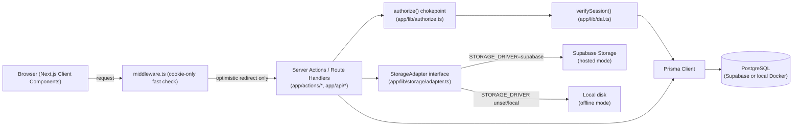
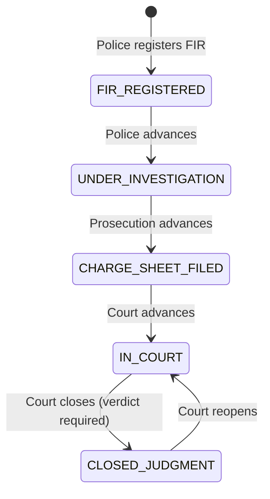
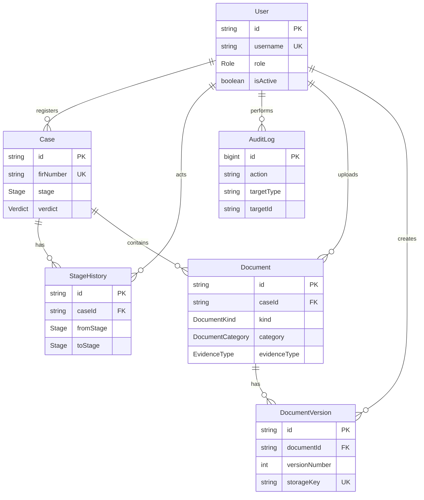
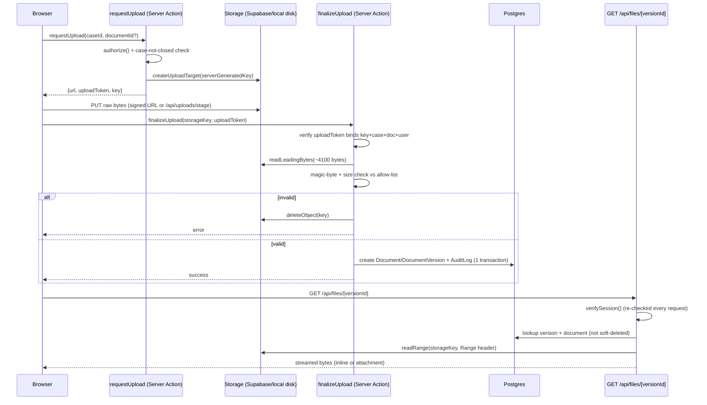

# CaseVault

CaseVault is a secure, centralized digital document management system for law
enforcement agencies, forensic labs, prosecution/legal departments, and
courts. Cases move through a defined lifecycle — FIR → Investigation → Charge
Sheet → Court → Judgment — and every case holds its documents (FIRs, witness
statements, charge sheets, court filings, forensic reports, judgments) and
digital evidence files, with every modification permanently recorded in a
write-once, append-only change log.

## Table of Contents

[Quick Start](#quick-start)
[Feature Catalogue](#feature-catalogue)
[Problem-Statement Capability Map](#problem-statement-capability-map)
[Architecture](#architecture)
[Security Deep-Dive](#security-deep-dive)
[Local/Offline Setup & Seeding](#localoffline-setup--seeding)
[Tech-Stack Rationale](#tech-stack-rationale)
[Screenshots](#screenshots)

## Quick Start

**Live demo:** [https://casevault-henna.vercel.app/login](https://casevault-henna.vercel.app/login)

| Username | Role | Title | Department |
|----------|------|-------|------------|
| `ramesh.kulkarni` | Police | Inspector | Kotwali PS |
| `anjali.menon` | Forensics | Scientific Officer | Regional FSL |
| `priya.deshmukh` | Prosecution | Public Prosecutor | District Court Complex |
| `arvind.rao` | Court | Judge | Sessions Court |
| `suresh.iyer` | Admin | System Administrator | CaseVault HQ |

All 5 demo accounts share the password `CaseVault@123`.

## Feature Catalogue

### Authentication & Access Control

- Users log in and are assigned exactly one role: Police (IO/SHO), Forensics (FSL), Prosecution/Legal, Court (clerk/judge), or Admin
- Admin can create users and assign roles/departments
- Server-side enforcement is scoped to FIR registration (Police/Admin only), stage advance (owning department/Admin only, forward one step), reopen (Court/Admin only), and no edits to a closed case

### Case Lifecycle

- Police can register a case (FIR) with core case metadata
- Case moves through stages: FIR Registered → Under Investigation → Charge Sheet Filed → In Court → Closed/Judgment, with Closed/Judgment reachable only via a dedicated close action that requires a verdict
- Each stage is owned by a department for the purpose of moving it forward (Police: FIR + Investigation; Prosecution: Charge Sheet; Court: Trial + Judgment/reopen); every department can see and edit any open case regardless of stage — stages are progress indicators, not access gates
- Advancing a case stage moves it into the next department's dashboard queue; no department gains or loses access to the case
- Each role has a dashboard showing the cases currently in its department's stage ("At your stage" + "All other cases" sections)

### Documents & Evidence

- Authorized users can upload documents to a case, typed by category, with magic-byte and size checks enforced server-side
- Authorized users can upload digital evidence files (photos, video/CCTV, forensic data) linked to a case, via signed upload URLs in hosted mode
- Documents keep version history — a new version never overwrites older ones, and all remain viewable

### Search & Discovery

- Users can find cases by case/FIR number and title, and filter by stage and date range, from a dedicated search page and a header quick-search, with all parameters Zod-validated and the page guarded by server-side authorization

### Change Log & Audit

- Every modification (upload, new version, delete, metadata edit, stage change, role/user change) is written to an append-only change log no one can edit or delete
- Users can view the change log for a case/document (who, what, when)

### Loading & UX Feedback

- Every click/navigation gives visible loading feedback — a global nav-progress bar, shape-matched route skeletons, and pending labels/spinners on logout, search, filters, case tabs, and media previews — so the platform never looks hung

## Problem-Statement Capability Map

| Capability | Status | Note |
|------------|--------|------|
| Centralized storage | Built | Every case's documents and evidence files live in one system, addressable by case, category, and version |
| Secure access/confidentiality | Built | Custom session auth restricts the app to authenticated users; every write path checks role via a single server-side `authorize()` chokepoint |
| Prevention of unauthorized modification | Built | Server-side role/action checks gate FIR registration, stage advance, reopen, and closed-case edits — never enforced only in the UI |
| Complete audit trail | Built | Every modification is written to a database-enforced append-only change log (`REVOKE` + trigger reject `UPDATE`/`DELETE`, even for Admin) |
| Search/retrieval | Built | Cases are searchable by case/FIR number, title, stage, and date range from a dedicated search page and header quick-search |
| Cross-department collaboration | Built | Every department can see and act on any open case as it moves through its lifecycle, with stage-owning departments handling the forward moves |
| Compliance | Partial | Role-based access, an immutable audit trail, and version-preserved documents support common records-retention and evidentiary-integrity expectations, but no formal compliance certification/reporting exists |
| Cloud | Built | Hosted deployment runs on Vercel + Supabase (Postgres + Storage); the identical codebase also runs fully offline via Docker Postgres + local disk, switched only by environment configuration |
| AI | Designed-for-Roadmap | Out of scope for v1 by explicit decision; OCR, auto-tagging, and natural-language search are noted as a later spec, never claimed as shipped |
| Blockchain | Designed-for-Roadmap | Out of scope for v1 by explicit decision; tamper evidence for v1 is provided by auth-gated access plus the append-only change log, not cryptographic anchoring |
| Digital signatures | Designed-for-Roadmap | Out of scope for v1 by explicit decision; not required for the internal-round demo |
| Scalability | Partial | The stack (Postgres + object storage + a stateless Next.js app) is horizontally scalable in principle, but the prototype has not been load-tested or tuned for production scale |
| Asset lifecycle | Partial | Digital evidence files carry version history and an audit trail across a case's lifecycle; physical asset/chain-of-custody tracking (vehicles, weapons, equipment) is explicitly out of scope |

| Pain Point (SIH problem statement) | Addressed By |
|-------------------------------------|--------------|
| Hard-to-locate documents | Centralized storage; Search/retrieval |
| Unauthorized access | Secure access/confidentiality; Prevention of unauthorized modification |
| Tampering risk | Complete audit trail; Prevention of unauthorized modification |
| No version control | Centralized storage (document version history) |
| Poor inter-department collaboration | Cross-department collaboration |
| Weak auditability | Complete audit trail |

## Architecture

**Stack:** Next.js 16.3.5 (App Router) + React 19.3.0 + TypeScript 5.9.3 on PostgreSQL 16/17 via Prisma 6.19.3, styled with Tailwind 4.x, with custom session auth (`jose` + `bcryptjs`) — no Auth.js/NextAuth, no Supabase Auth.

**Project structure:**

```
app/
├── (auth)/login/          # Login page + Demo Accounts panel (DEMO_MODE gated)
├── (app)/                 # Authenticated route group
│   ├── dashboard/         # Role-scoped case queues
│   ├── cases/[id]/        # Case detail + Documents/Evidence/Change Log tabs
│   ├── cases/new/         # FIR registration (Police/Admin)
│   ├── search/            # Cross-case search
│   ├── admin/users/       # User management (Admin)
│   ├── admin/log/         # Audit log + tamper-test panel (Admin)
│   └── access-denied/     # Server-side authorize() redirect target
├── actions/               # Server Actions (cases, documents, users, audit, auth)
├── api/files/[versionId]/ # Sole authenticated file-read chokepoint
├── api/uploads/stage/     # Local-disk-mode upload PUT target
└── lib/
    ├── authorize.ts       # Single authorization chokepoint
    ├── session.ts         # jose-signed session JWT (8h sliding)
    ├── dal.ts             # verifySession() — DB re-check every call
    ├── case-guards.ts     # Stage-machine pure guard functions
    ├── document-guards.ts # Document-ownership/category guard functions
    ├── file-magic.ts      # Magic-byte allow-lists + detection
    └── storage/           # StorageAdapter interface + Supabase/local impls
prisma/
├── schema.prisma          # 6-model schema (User, Case, StageHistory, AuditLog, Document, DocumentVersion)
├── migrations/            # Includes hand-edited append-only trigger SQL
└── seed.ts                # Demo accounts + hero case + supporting cases
```

**Authorization is enforced by exactly one server-side chokepoint.** Every Server Action and Route Handler in this app calls `authorize()` (`app/lib/authorize.ts`), which always re-reads the caller's current role from the database via `verifySession()` before deciding — never from a cached or JWT-embedded value. `middleware.ts` is **UX-only**: it performs an optimistic cookie decode with no database call, purely to redirect an obviously-unauthenticated visitor before a page even starts rendering. It is never the authorization authority, and no route in this codebase treats it as one — the real gate is always `authorize()` on the server.

**File storage is switched by one environment variable, never by code branching.** The `StorageAdapter` interface (`app/lib/storage/adapter.ts`) is implemented by both `SupabaseStorageAdapter` and `LocalDiskStorageAdapter`; `getStorageAdapter()` picks between them purely based on `STORAGE_DRIVER` — `"supabase"` selects the hosted adapter, anything else (including unset) selects the local-disk adapter. Every caller — upload, finalize, read — goes through this same interface regardless of which adapter is active.

**Deployment** runs in two modes off the identical codebase: the primary demo is Vercel (app) + Supabase (Postgres + Storage), and the same code also runs fully offline on a single laptop via Docker Compose Postgres + local disk storage, as insurance against venue internet failure. Only environment configuration differs between the two.

### System Architecture



### Case Lifecycle State Machine

Forward-one-step only; `CLOSED_JUDGMENT` is reachable only via a dedicated close action requiring a verdict, never via a plain advance; only the owning department or Admin may advance a stage; Court or Admin may reopen a closed case.



### ER Data Model



### Upload + File-Serving Sequence


